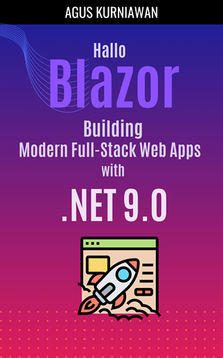

# Hallo Blazor: Building Modern Full-Stack Web Apps with .NET 9

Unlock the power of modern web development with *Hallo Blazor: Building Modern Full-Stack Web Apps with .NET 9*. This definitive guide takes you on a journey through Microsoft’s innovative Blazor framework, enabling you to build dynamic, interactive, and high-performance web applications using the simplicity of C#. Whether you're an aspiring developer or an experienced professional, this book equips you with the skills to create cutting-edge, full-stack web applications with ease.

Packed with hands-on labs, real-world examples, and step-by-step tutorials, this book covers everything you need to know about Blazor, from building reusable components and managing layouts to implementing Progressive Web Apps (PWAs) and working with databases. Learn how to fully leverage .NET 9 to craft responsive, scalable, and maintainable applications that stand out in today’s competitive market. Each chapter combines theory with practical exercises, making it the perfect resource for mastering Blazor’s server and WebAssembly hosting models.

Whether you're transitioning from JavaScript frameworks like React or Angular, or you're exploring full-stack web development for the first time, *Hallo Blazor* provides a comprehensive roadmap to success. By the end of this book, you'll have the confidence and expertise to build modern, user-friendly applications that meet the demands of today’s web users. Step into the future of web development—grab your copy of *Hallo Blazor: Building Modern Full-Stack Web Apps with .NET 9* today!

## Hands-on Lab Exercises

Here is a list of exercises that you will find in the book:

* Exercise 1: Building Your First Blazor App
* Exercise 2: Building a Razor Component for Time-Based Greetings
* Exercise 3: Building a Razor Component for Personalized Greetings
* Exercise 4: Building a Razor Component That Logs Lifecycle Events to the Console
* Exercise 5: Creating a Reusable Component to Display a Table
* Exercise 6: One-Way and Two-Way Data Binding in Blazor
* Exercise 7: Handling Events in Blazor
* Exercise 8: Navigation and Routing in Blazor
* Exercise 9: Building a Registration Form in Blazor
* Exercise 10: Building a Simple Form with Custom Validator in Blazor
* Exercise 11: State Management in Blazor
* Exercise 12: Using Bootstrap CSS in Blazor (Local and Global CSS Usage)
* Exercise 13: Using Tailwind CSS in Blazor (Local and Global CSS Usage)
* Exercise 14: Using Images and Videos in Blazor
* Exercise 15: Working with Layouts in Blazor
* Exercise 16: Working with Dependency Injection in Blazor Web App
* Exercise 17: Building Full-Stack Blazor Applications
* Exercise 18: Building Full-Stack Blazor App for ToDo Application
* Exercise 19: Building a PWA with Blazor WebAssembly Standalone App
* Exercise 20: Building a Registration Form in Blazor PWA
* Exercise 21: A Full-Stack Blazor Progressive Web App (PWA) and ASP.NET Core Minimal API
* Exercise 22: Calling JavaScript Functions from Blazor PWA
* Exercise 23: Working with Local Storage in Blazor PWA
* Exercise 24: Uploading an Image File in Blazor Web App with Server Rendering
* Exercise 25: Uploading an Image File to the Server in Blazor PWA

## How to Buy

You can buy this book the following online stores:

* Google Play Books: https://play.google.com/store/books/details?id=HnVBEQAAQBAJ
* Lulu: 
* Apple iBookstore: 
* Leanpub:  

